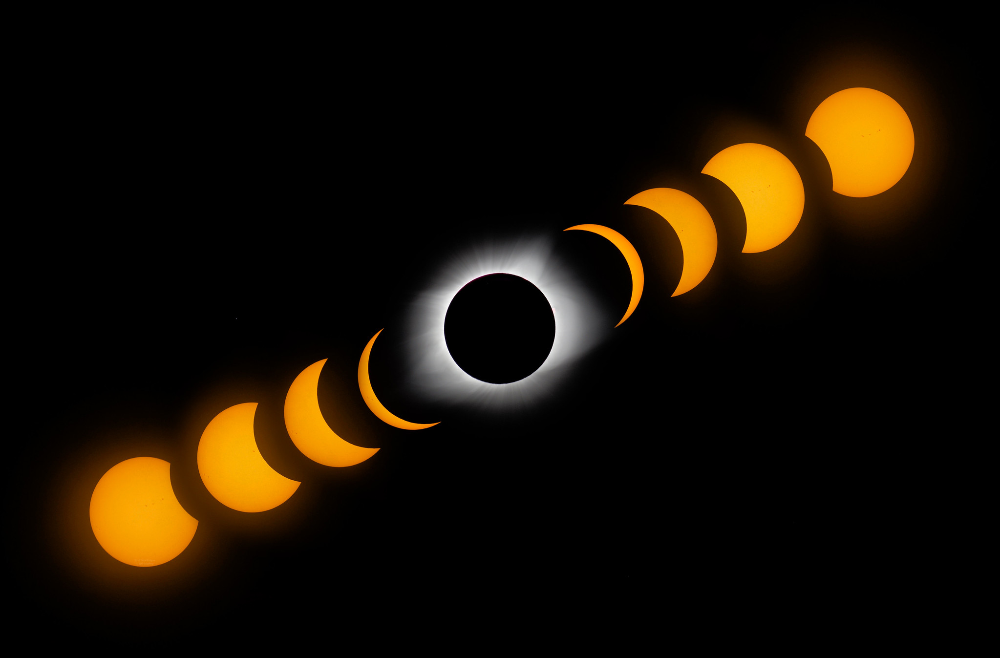

# 2024 Total Solar Eclipse
[Get Hyped](https://youtu.be/AwlGxVcVNNw?feature=shared) 🌑  - A plan for the 2024 eclipse happening on **April 8th 3:15PM**.  

Ohio likely has the most people in totality outside of Texas.

 - If you're in Youngstown, drive 5 miles North
 - If you're in Canton, drive 5 miles North
 - If you're in Columbus, drive 10 miles North
 - If you're in Cincinnati, drive 15 miles North

Path over Ohio

Path over US

## Helpful Resources

### Videos

 - [Smarter Every Day](https://youtu.be/eNK2LI7VeX4?feature=shared) What you need to know
 - [Jeff Geerling](https://youtu.be/J-0i4wVHVdc?feature=shared) How to shoot the eclipse 📷 (see below)
 - [NASA](https://www.youtube.com/live/2MJY_ptQW1o?feature=shared) Official Broadcast on eclipse day

### Links

 - [Interactive google map](https://eclipse2024.org/eclipse_cities/statemap.html)
 - https://www.smartereveryday.com/eclipse
 - https://science.nasa.gov/eclipses/future-eclipses/eclipse-2024/where-when/

## Gear for Eclipse Day

### Glasses
You must have glasses that are `ISO 12312-2` certified. Buy them now, the price won't go down. Here are two options:
 - [these](https://www.amazon.com/gp/product/B01N9T9CZL/ref=ppx_yo_dt_b_asin_title_o00_s00?ie=UTF8&psc=1) which I bought a while back
 - [these](https://www.eclipseglasses.com/collections/eclipse-glasses-stock?sca_ref=2753051.yTIACw5DUs) by American Paper Optics

### Apps
There are two apps available for free, with an in-app purchase for a guided tour / push notifications for the 2024 eclipse.

 - [Solar Eclipse Timer](https://www.solareclipsetimer.com) is the defacto standard for Solar Eclipse Apps.  
   
    
    
 - [The Eclipse App](https://theeclipse.company/app) from The Planetary Society
   
    
    )

### Experiments

 - A white sheet, lay it on the ground to view [Shadow Bands](https://en.wikipedia.org/wiki/Shadow_bands) 
 - colander or a hand held cheese grater
 - High contrast green/red boards for [Purkinje Effect](https://en.wikipedia.org/wiki/Purkinje_effect)